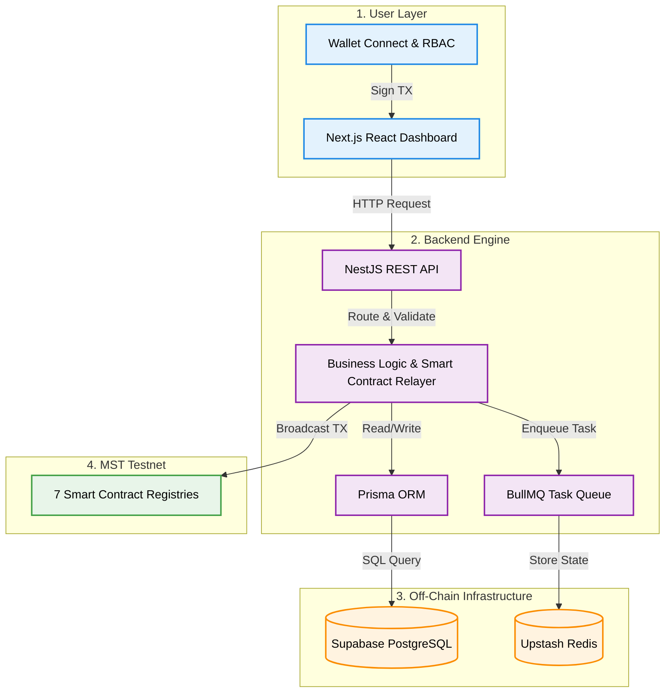
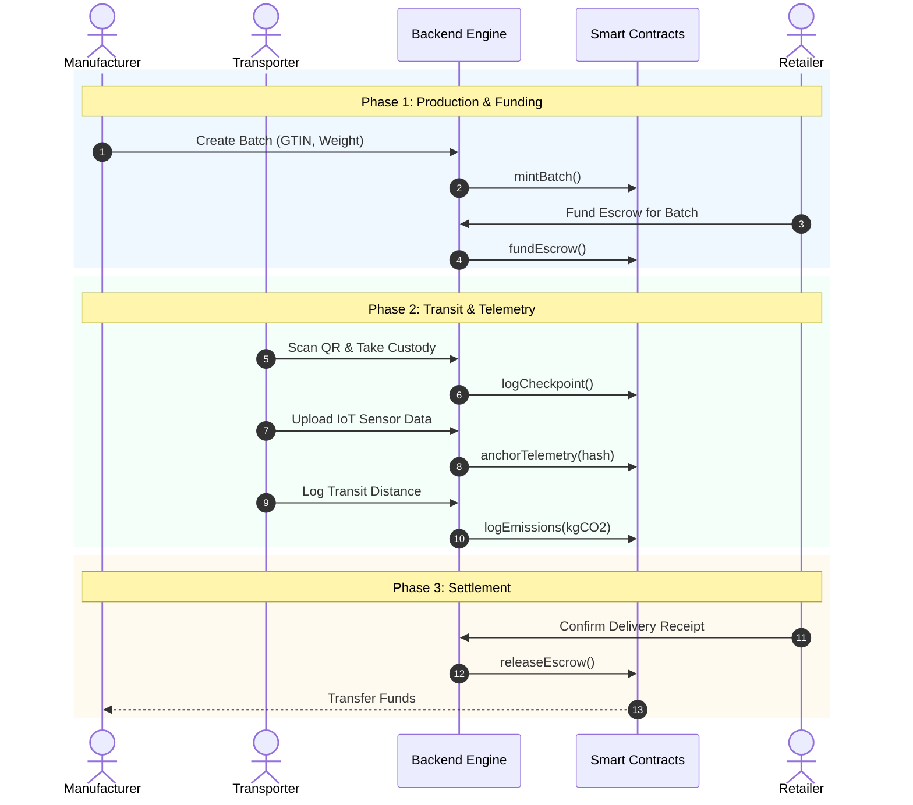
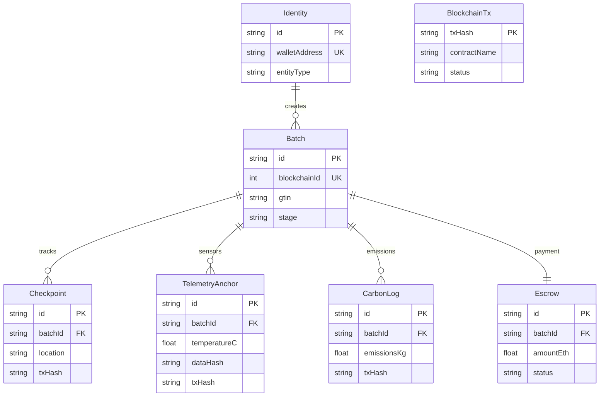

# MST Supply Chain: Next-Gen Supply Chain Ecosystem ⛓️📦

<div align="center">
  <h3>Enterprise-Grade Traceability on the MST Testnet</h3>
</div>

## 📖 Overview

**MST Supply Chain** is an enterprise-grade, Web3-powered supply chain management ecosystem built on the **MST Testnet Blockchain**. It provides an immutable, transparent, and highly performant platform for tracking goods, managing decentralized identities, anchoring IoT telemetry, tracking carbon emissions, and securely handling escrow payments.

Our hybrid architecture leverages smart contracts for absolute trust and an off-chain NestJS, PostgreSQL, and Redis engine for rapid querying and seamless user experiences.

---

## 🏗️ System Architecture

The ecosystem relies on a robust hybrid architecture. The Frontend Portal connects with the Backend Engine via REST API. The Backend Engine processes business logic, queues tasks in Redis, syncs with Postgres, and acts as a Relayer to interact with the Smart Contracts.



---

## ⚙️ Workflows & Data Models

### Supply Chain Lifecycle

This sequence diagram illustrates the step-by-step lifecycle of a batch passing through the supply chain: Minting, Handover, IoT Telemetry, Carbon tracking, and Escrow Release.



### Database Schema (ERD)

The relational schema strictly maps our on-chain data architecture to highly queryable off-chain Postgres tables, linked universally by the `txHash`.



---

## 🚀 Getting Started

### Prerequisites
Before you begin, ensure you have the following installed and set up:
* **Node.js** (v18.17.0 or higher)
* **Git**
* **MetaMask Extension** installed in your browser.
* **MST Testnet Configuration:**
  * **Network Name:** MST Testnet
  * **RPC URL:** `https://testnetrpc.mstblockchain.com`
  * **Chain ID:** `(Add Chain ID here)`
  * **Currency Symbol:** `tMST`

### 1. Clone the Repository
```bash
git clone https://github.com/mohitdeshmukhdev/MST-SupplyChain.git
cd MST-SupplyChain
```

### 2. Backend Setup
Navigate to the backend directory, install dependencies, and start the engine:
```bash
cd backend-engine
npm install

# Ensure your .env file is configured with Supabase DATABASE_URL, Upstash REDIS_URL, MST_RPC_URL, and RELAYER_PRIVATE_KEY.
# Generate Prisma Client
npx prisma generate

# Start the NestJS server (runs on http://localhost:5000)
npm run start:dev
```

### 3. Frontend Setup
Open a new terminal window, navigate to the frontend portal, and start the development server:
```bash
cd frontend-portal
npm install

# Start the Next.js app (runs on http://localhost:3000)
npm run dev
```

### 4. Prisma Studio (Optional Database GUI)
To visualize and manage the Supabase database locally:
```bash
cd backend-engine
npx prisma studio
# Opens at http://localhost:5555
```

---

## 🛠️ Tech Stack
* **Blockchain:** MST Testnet, Solidity, ethers.js v6
* **Backend:** NestJS, Prisma (PostgreSQL on Supabase), BullMQ (Redis on Upstash)
* **Frontend:** Next.js (App Router), ReactFlow, TailwindCSS v4, shadcn/ui, Wagmi v2, RainbowKit
* **Tooling:** Hardhat, html5-qrcode

---
## 📄 License
This project is licensed under the MIT License.
