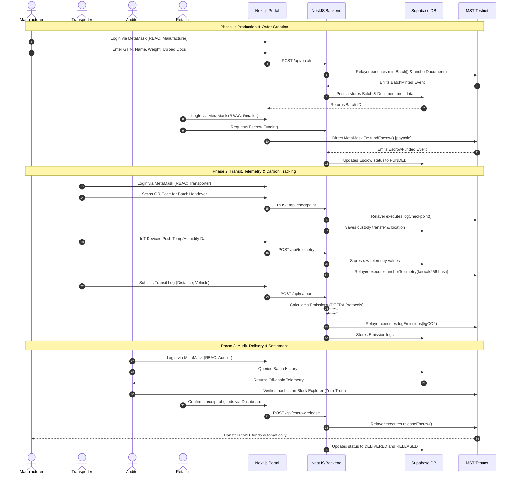
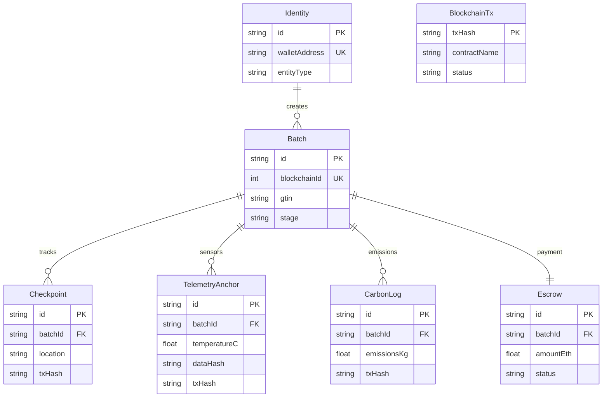

# MST Supply Chain: Next-Gen Supply Chain Ecosystem ⛓️📦

<div align="center">
  <h3>Enterprise-Grade Traceability on the MST Testnet</h3>
</div>

## 📖 Overview

**MST Supply Chain** is an enterprise-grade, Web3-powered supply chain management ecosystem built on the **MST Testnet Blockchain**. It provides an immutable, transparent, and highly performant platform for tracking goods, managing decentralized identities, anchoring IoT telemetry, tracking carbon emissions, and securely handling escrow payments.

Our hybrid architecture leverages smart contracts for absolute trust and an off-chain NestJS, PostgreSQL, and Redis engine for rapid querying and seamless user experiences.

---

## 🏗️ System Architecture

The ecosystem relies on a highly detailed hybrid architecture. The Next.js frontend handles Web3 RBAC, while the NestJS backend processes business logic, utilizes BullMQ for asynchronous blockchain transactions, mirrors data in Supabase, and bridges strictly to the 7 Layer-1 Smart Contracts.

```mermaid
flowchart LR
    classDef client fill:#f8fafc,stroke:#cbd5e1,stroke-width:2px,color:#0f172a
    classDef backend fill:#eff6ff,stroke:#3b82f6,stroke-width:2px,color:#1e3a8a
    classDef db fill:#fff7ed,stroke:#f97316,stroke-width:2px,color:#7c2d12
    classDef blockchain fill:#f0fdf4,stroke:#22c55e,stroke-width:2px,color:#14532d
    classDef rpc fill:#dcfce7,stroke:#16a34a,stroke-width:3px,color:#14532d,stroke-dasharray: 5 5

    subgraph UserLayer [1. Client & Presentation Layer]
        direction TB
        Wagmi["Web3 Provider & RBAC\n- Manages MetaMask wallet connections\n- Enforces strictly typed Manufacturer/Transporter roles\n- Handles EIP-712 cryptographic signatures"]:::client
        UI["React Web Interface (Next.js)\n- Renders SSR Dashboards & visual pipelines\n- Processes HTML5 QR Code scanning for custody\n- Responsive TailwindCSS & shadcn/ui components"]:::client
    end

    subgraph BackendLayer [2. Core Backend Engine (NestJS)]
        direction TB
        API["REST API Controllers\n- Exposes secure, rate-limited endpoints\n- Validates incoming JSON payloads\n- Parses authentication headers"]:::backend
        Services["Business Logic & Smart Contract Relayer\n- Executes core supply chain rules & constraints\n- Signs txs server-side via ethers.js Relayer wallet\n- Eliminates gas fees for end-users (Gasless UX)"]:::backend
        Prisma["Prisma ORM (Data Access Layer)\n- Manages highly concurrent PostgreSQL connections\n- Executes type-safe, optimized SQL queries\n- Translates blockchain state to relational DB"]:::backend
        BullMQ["BullMQ Task Queues (Async Workers)\n- Handles async blockchain tx broadcasting\n- Ensures reliable delivery with exponential backoff\n- Prevents RPC node rate-limiting and drops"]:::backend
    end

    subgraph DataLayer [3. Off-Chain Infrastructure]
        direction TB
        Supabase[("Supabase PostgreSQL DB\n- Mirrors on-chain state for instant UI rendering\n- Stores raw, unstructured telemetry & batch data\n- Provides complex JOIN queries impossible on-chain")]:::db
        Upstash[("Upstash Redis Cache\n- Stores volatile BullMQ background job states\n- Caches frequently accessed supply chain lookups\n- High-speed, low-latency key-value store")]:::db
    end

    subgraph BlockchainLayer [4. MST Testnet Blockchain - Layer 1]
        direction TB
        RPC(("MST Testnet RPC Node\nethers.js Provider Endpoint\n(Broadcasts Signed Txs)")):::rpc
        IdentitySC["IdentityRegistry.sol\n- Stores IPFS KYC CIDs & Entity Roles\n- Validates on-chain permissions"]:::blockchain
        BatchSC["BatchRegistry.sol\n- Tracks granular product lifecycle stages\n- Immutable links to Manufacturer & Custodian"]:::blockchain
        CheckpointSC["Checkpoint.sol\n- Logs spatial custody handovers & GPS data\n- Maintains unforgeable transit history"]:::blockchain
        EscrowSC["EscrowRegistry.sol\n- Locks Retailer funds in secure smart contract\n- Automates zero-trust milestone payouts"]:::blockchain
        CarbonSC["CarbonRegistry.sol\n- Logs DEFRA-compliant emission records\n- Tracks kgCO2 footprint per transit leg"]:::blockchain
        DocSC["DocumentRegistry.sol\n- Anchors IPFS document Keccak256 hashes\n- Mathematically validates Bill of Lading integrity"]:::blockchain
        TelemetrySC["TelemetryRegistry.sol\n- Anchors IoT sensor Keccak256 hashes\n- Proves untampered temperature/humidity datasets"]:::blockchain
    end

    %% Flow Connections
    Wagmi -->|1. Signatures| UI
    UI -->|2. HTTP Requests| API
    API -->|3. Routes Data| Services
    
    Services -->|4. Reads/Writes| Prisma
    Prisma -->|5. Executes SQL| Supabase
    
    Services -->|6. Enqueues Tx| BullMQ
    BullMQ -.->|7. Worker Processing| Services
    BullMQ -->|8. Manages State| Upstash
    
    Services -->|9. Broadcasts Tx| RPC
    RPC -->|mintBatch| BatchSC
    RPC -->|logCheckpoint| CheckpointSC
    RPC -->|fundEscrow| EscrowSC
    RPC -->|registerIdentity| IdentitySC
    RPC -->|logEmissions| CarbonSC
    RPC -->|anchorTelemetry| TelemetrySC
    RPC -->|anchorDocument| DocSC
```

---

## ⚙️ Workflows & Data Models

### Comprehensive All-Users Flow

This sequence diagram illustrates the entire end-to-end user flow, incorporating all actors (Manufacturer, Transporter, Auditor, and Retailer) and mapping exactly how they interact with the portal, the backend relayer, the database, and the blockchain.



### Database Schema (ERD)

The relational schema strictly maps our on-chain data architecture to highly queryable off-chain Postgres tables, linked universally by the `txHash`.



---

## 🚀 Getting Started

### Prerequisites
Before you begin, ensure you have the following installed and set up:
* **Node.js** (v18.17.0 or higher)
* **Git**
* **MetaMask Extension** installed in your browser.
* **MST Testnet Configuration:**
  * **Network Name:** MST Testnet
  * **RPC URL:** `https://testnetrpc.mstblockchain.com`
  * **Chain ID:** `(Add Chain ID here)`
  * **Currency Symbol:** `tMST`

### 1. Clone the Repository
```bash
git clone https://github.com/mohitdeshmukhdev/MST-SupplyChain.git
cd MST-SupplyChain
```

### 2. Backend Setup
Navigate to the backend directory, install dependencies, and start the engine:
```bash
cd backend-engine
npm install

# Ensure your .env file is configured with Supabase DATABASE_URL, Upstash REDIS_URL, MST_RPC_URL, and RELAYER_PRIVATE_KEY.
# Generate Prisma Client
npx prisma generate

# Start the NestJS server (runs on http://localhost:5000)
npm run start:dev
```

### 3. Frontend Setup
Open a new terminal window, navigate to the frontend portal, and start the development server:
```bash
cd frontend-portal
npm install

# Start the Next.js app (runs on http://localhost:3000)
npm run dev
```

### 4. Prisma Studio (Optional Database GUI)
To visualize and manage the Supabase database locally:
```bash
cd backend-engine
npx prisma studio
# Opens at http://localhost:5555
```

---

## 🛠️ Tech Stack
* **Blockchain:** MST Testnet, Solidity, ethers.js v6
* **Backend:** NestJS, Prisma (PostgreSQL on Supabase), BullMQ (Redis on Upstash)
* **Frontend:** Next.js (App Router), ReactFlow, TailwindCSS v4, shadcn/ui, Wagmi v2, RainbowKit
* **Tooling:** Hardhat, html5-qrcode

---
## 📄 License
This project is licensed under the MIT License.
