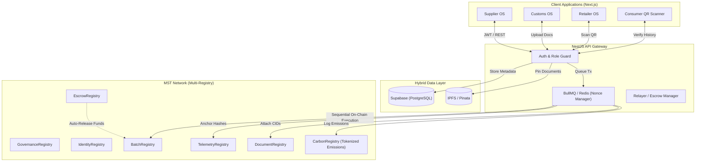

<div align="center">

# ⛓ MST SaralChain: The Global Supply Chain Network State


<p>
  <strong>A 100% On-Chain Enterprise Supply Chain Ecosystem Powered Exclusively by the MST Blockchain</strong><br/>
  Decentralizing global logistics — from manufacturing and customs to retail and automated escrow settlements.
</p>

<p>
  
  
  
  
  
  
</p>

<p>
  
  
  
</p>

</div>

---

> **"Transforming fragmented global logistics into a fully decentralized, cryptographically secure supply chain protocol on the MST Blockchain."**

---

## 🚨 The Systemic Crises in Global Supply Chains

The modern logistics ecosystem operates on fragmented Web2 infrastructure, creating immense friction, fraud, and delays.

### 1. The Trust Deficit & Counterfeit Goods
Counterfeit pharmaceuticals, luxury goods, and electronics cost the global economy billions annually. Traditional ERP systems offer zero cryptographic guarantees. Because these databases are vulnerable to internal tampering, buyers and customs officials are forced to trust unverified paperwork, leading to fatal consequences in industries like healthcare.

### 2. Siloed, Non-Portable Logistics Data
A product's journey—manufacturing origin, IoT temperature readings, customs clearance, and warehouse handoffs—is scattered across disconnected systems. No single entity has a provable, real-time view of the cargo. When disputes arise over spoiled goods, auditing these fragmented systems takes months.

### 3. Inefficient, Trust-Based Settlements
International trade relies on archaic Letters of Credit (LCs) and slow wire transfers. Suppliers ship millions of dollars of goods and wait 60-90 days to get paid, while buyers pray the goods arrive in promised conditions. There is no automated, trustless escrow.

---

## 💡 The Cryptographic Solution: MST SaralChain

**MST SaralChain** eradicates these systemic flaws by migrating the entire supply chain to a deterministic, immutable state machine: the **MST Blockchain**.

### 1. Absolute Cryptographic Truth (Multi-Registry & IPFS)
Instead of a database row, every batch of goods, IoT temperature ping, and customs document is anchored to the MST Blockchain through a robust **Multi-Registry Smart Contract Architecture**. Bills of Lading are pinned to IPFS, ensuring they can never be altered. Verification becomes instant, free, and mathematically indisputable.

### 2. The Unified, Portable Product Graph
By utilizing GS1 GTINs combined with blockchain batch IDs, every product becomes a verifiable physical asset with a digital twin. From a smartphone QR scanner to enterprise ERPs, the product's entire lifecycle is cryptographically anchored to a single source of truth.

### 3. Trustless Financial Settlements (Native Escrow)
Using the native `tMST` token, buyers deposit funds into the `EscrowRegistry` smart contract. The funds are mathematically locked until the `BatchRegistry` confirms the goods have physically reached the Retailer. Payments settle in seconds, completely bypassing banks and letters of credit.

---

## 🏗️ Deep Technical Architecture

MST SaralChain operates as a highly sophisticated hybrid ecosystem. It bridges Web2 UX paradigms (handling massive IoT data loads off-chain) with uncompromising Web3 cryptographic guarantees (anchoring hashes on-chain).



---

## 🧠 The Depth of the Project: How It Actually Works

### 1. The High-Frequency IoT Hash Anchoring Lifecycle
If we forced IoT sensors to write every temperature ping directly to the EVM, the gas costs and nonce collisions would crash the system. 
1. **Off-Chain Ingestion:** IoT sensors ping the NestJS backend with location and temperature data.
2. **Relational Storage:** The data is saved in Supabase for fast, complex querying.
3. **Queue & Batching:** BullMQ queues these updates sequentially.
4. **On-Chain Hashing:** Every few minutes, the backend calculates a `keccak256` hash of the batch's recent data and anchors *only the hash* to the `TelemetryRegistry`.
5. **Zero Nonce Collisions:** A dedicated Relayer wallet processes the queue sequentially, ensuring perfect transaction execution on the MST network.

### 2. The Trustless Escrow Lifecycle
1. Retailer creates a Purchase Order and deposits `tMST` into the `EscrowRegistry`.
2. The Supplier manufactures and dispatches the goods (`BatchRegistry` stage updates).
3. The goods clear customs (`DocumentRegistry` attaches IPFS CIDs).
4. The Retailer scans the QR code upon physical delivery, triggering a `RetailReady` state change.
5. The `EscrowRegistry` detects this state change and automatically transfers the `tMST` to the Supplier. 

---

## 🚀 The Core Operating Systems (OS)

We provide highly specialized, modular Operating Systems tailored for every stakeholder in the supply chain.

### 🏭 1. Supplier OS
- **Batch Minting:** Define `quantity`, `unit`, `productionDate`, and `gs1Gtin`.
- **Logistics Handoff:** Transfer cryptographic ownership to transporters.

### 🚚 2. Logistics OS
- **Live Telemetry:** Feed GPS and temperature data into the system.
- **Proof of Transit:** Cryptographically prove goods were maintained at correct conditions.

### 🛂 3. Customs OS
- **Compliance Uploads:** Upload Phytosanitary and Origin certificates to IPFS.
- **Clearance Approval:** Cryptographically sign off on border crossings.

### 🏪 4. Retailer OS
- **Escrow Management:** Fund smart contracts for upcoming shipments.
- **Receiving & Verification:** Scan incoming pallets to release escrow payments and take ownership.

### 📱 5. Consumer OS (Zero-Cost QR)
- **Instant Verification:** End-consumers point their phone camera at the physical product QR code (powered by HTML5-QRCode) to instantly read the entire unforgeable MST Blockchain history.

---

## ⚙️ Technical Specifications

### Tech Stack Matrix

| Category | Technologies Used | Purpose |
|---|---|---|
| **Frontend** | Next.js, React, TailwindCSS | High-performance, responsive UI |
| **QR Scanning** | HTML5-QRCode | Free, in-browser mobile/webcam scanning |
| **Backend** | NestJS, TypeScript, REST | Scalable microservice architecture |
| **Queueing** | Upstash (Serverless Redis), BullMQ | EVM Nonce collision prevention |
| **Database** | Supabase (PostgreSQL), Prisma | Relational metadata and fast querying |
| **Blockchain** | **MST Network**, Hardhat, Ethers.js | The immutable multi-registry ledger |
| **Storage** | IPFS | Decentralized document storage |

### Smart Contracts Ecosystem (Multi-Registry)

| Contract Name | Functionality |
|---|---|
| `GovernanceRegistry.sol` | The RBAC root. Manages system-wide Admin roles. |
| `IdentityRegistry.sol` | Decentralized KYC (Wallet ↔ Corporate Identity). |
| `BatchRegistry.sol` | Core physical asset tracking and lifecycle stages. |
| `TelemetryRegistry.sol` | GPS and environmental condition hash anchoring. |
| `DocumentRegistry.sol` | IPFS CID mapping for Customs and Compliance docs. |
| `EscrowRegistry.sol` | Trustless tMST native crypto payment settlements. |
| `CarbonRegistry.sol` | Tokenized carbon footprint calculation across the transit lifecycle. |

---

## 🚀 Quick Start (Local Development)

### Prerequisites
- Node.js v20+
- A funded MST Testnet Wallet (tMST)
- Supabase & Upstash accounts (Free Tier)

### 1. Clone & Install
```bash
git clone https://github.com/mohitdeshmukhdev/MST-SupplyChain.git
cd "MST-SupplyChain/backend-engine"
npm install
```

### 2. Environment Variables
Configure your `.env` in `backend-engine` with your Supabase URL, Upstash Redis URL, and Relayer Private Key.

### 3. Deploy Multi-Registry Contracts
```bash
npx hardhat test # Verify logic first
npx hardhat run scripts/deploy.js --network mstTestnet
```

### 4. Sync Prisma & Start Backend
```bash
npx prisma db push
npm run start:dev
```

---

<div align="center">
  <p>Engineered with ❤️ for the <strong>MST Blockchain Grant Program</strong></p>
  <p><em>Building the completely decentralized future of Global Trade.</em></p>
</div>
