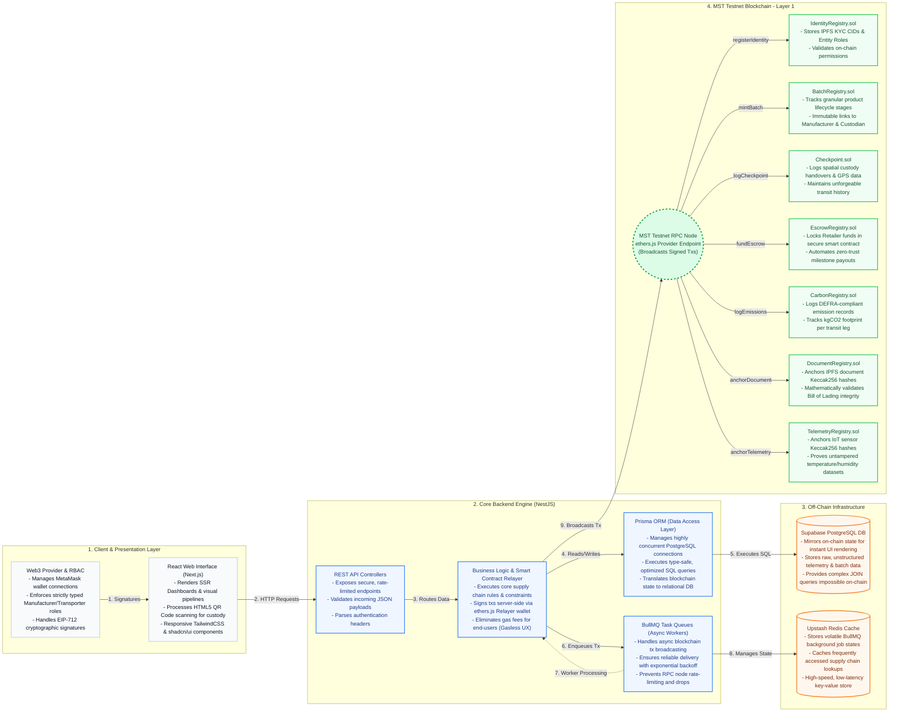
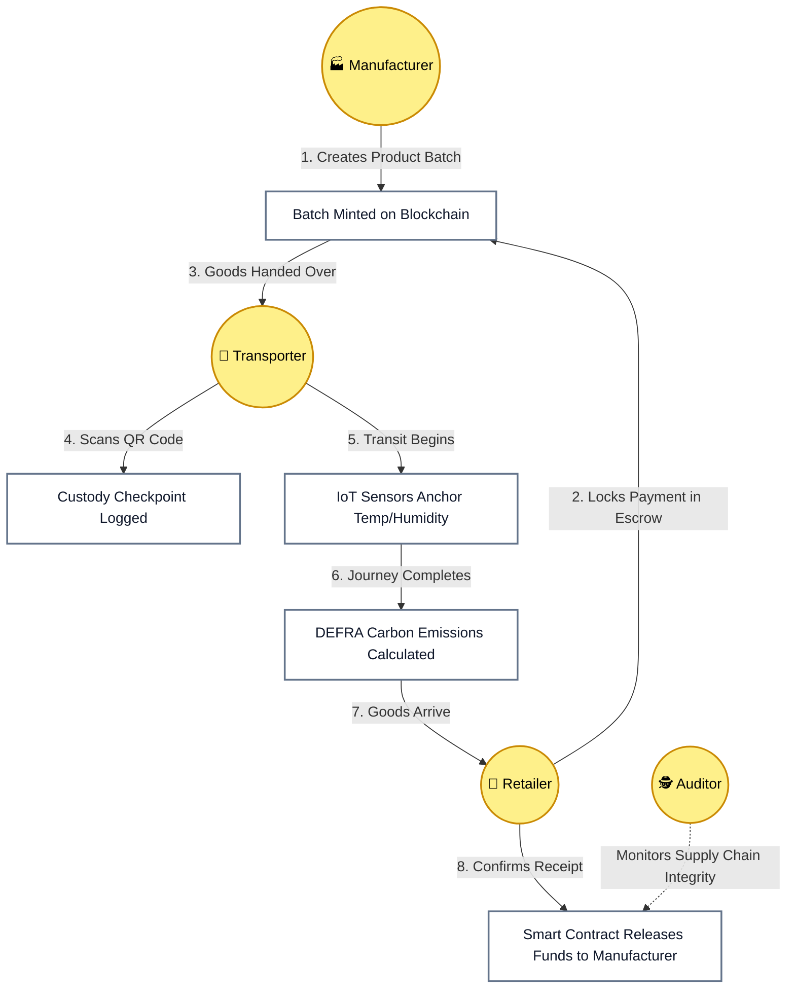
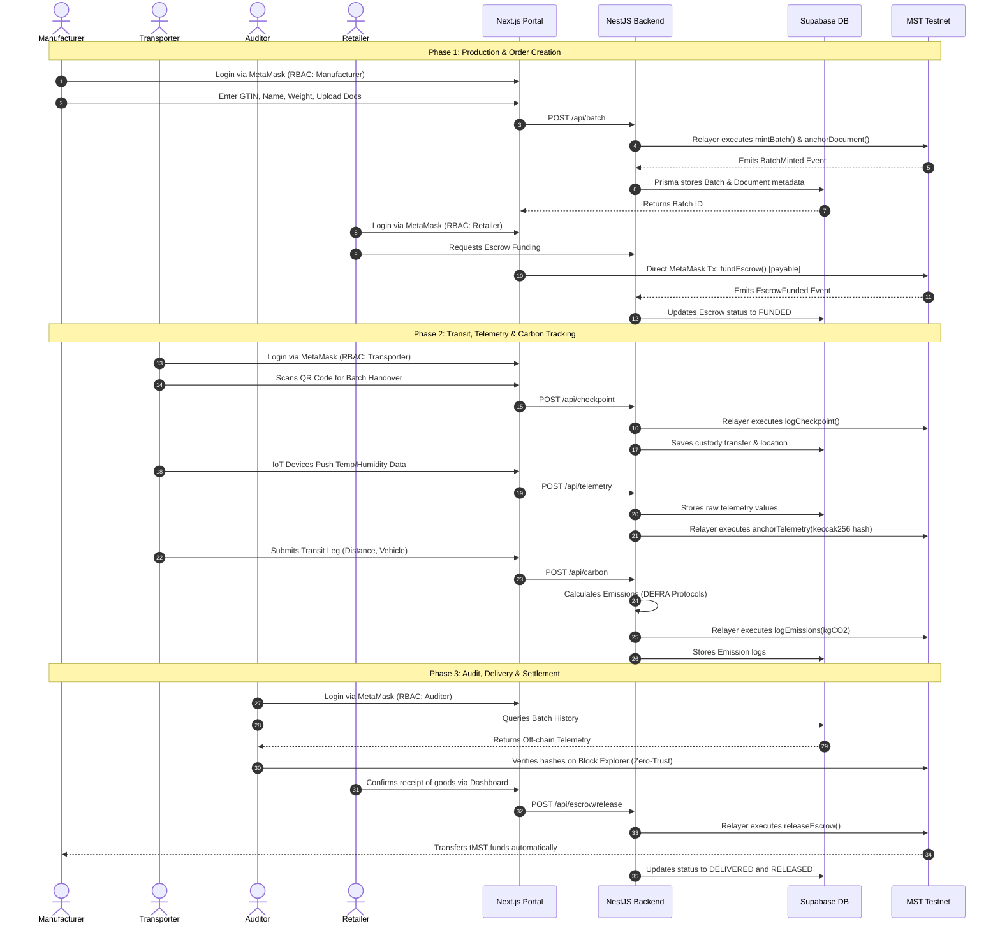
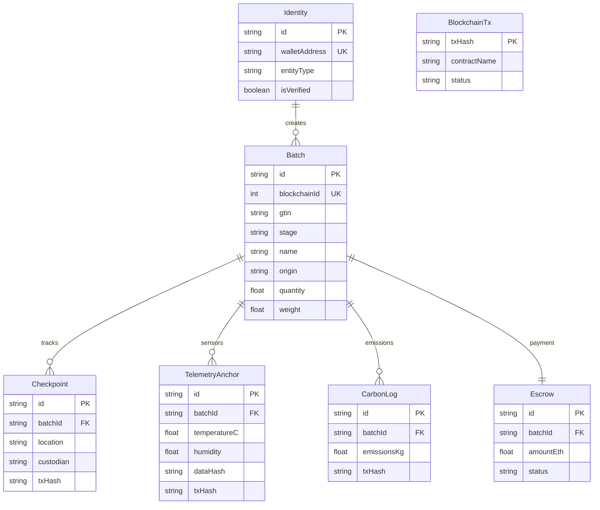

<div align="center">

# ⛓️ MST SaralChain: Enterprise Supply Chain Ecosystem

<h3>Decentralized Identity, Real-Time IoT Telemetry & Carbon Tracking on the MST Blockchain</h3>

<p>
  
  
  
  
  
</p>

<p>
  
  
  
</p>

</div>

---

> **"Bridging enterprise Web2 transaction speeds with the immutable, zero-trust guarantees of the Layer-1 MST Testnet Blockchain."**

---

## 📖 Overview

**MST SaralChain** is a state-of-the-art, Web3-enabled supply chain traceability and financial settlement engine built specifically for the **MST Testnet Blockchain**. The platform guarantees complete, end-to-end transparency for global logistics by anchoring critical milestones, sensor records, compliance documents, and carbon footprints to an immutable ledger while ensuring lightning-fast user interactions through a hybrid off-chain synchronization layer.

### Platform Architecture & Data Ingestion Pipeline

The platform uses a hybrid stack of **Next.js (App Router)** for Web3-enabled user portals, **NestJS** as the core backend gateway, a **Redis + BullMQ queue** to guarantee error-free asynchronous transaction broadcasting, **Supabase PostgreSQL** for sub-15ms querying, and **7 specialized Smart Contracts** on the MST Testnet for decentralization:


> **Core Workflow Topology:** 4 Client Portals → NestJS API Gateway → Redis/BullMQ Asynchronous Queue → Supabase Postgres + IPFS → L1 MST Testnet (7 Smart Contracts)

---

## 💡 Systemic Supply Chain Gaps & Cryptographic Solutions

Traditional supply chains face massive bottlenecks, trust gaps, and infrastructure failures. Here is how MST SaralChain addresses them:

### 1. The Trust Deficit & Document Forgery
* **The Gap:** Paper bills of lading, compliance documents, and quality certificates are easily altered. Background verification requires days of auditing, manual document reviews, and costly third-party checks.
* **The Solution:** **Hash-Anchoring Proofs**. Uploaded documents are saved on IPFS and their cryptographically secure `keccak256` content hashes are anchored to the blockchain via `DocumentRegistry.sol`. Any alteration of the document breaks the mathematical verification.

### 2. Transaction Collision & Ingestion Latency (The Nonce Crisis)
* **The Gap:** In a high-speed logistics chain, thousands of IoT devices and scanners push telemetry logs simultaneously. Submitting these directly to EVM blockchain nodes from a single backend wallet triggers **EVM Nonce Conflicts**, resulting in dropped transactions and synchronization failures.
* **The Solution:** **Redis & BullMQ FIFO Transaction Queue**. Incoming telemetry data returns a `202 Accepted` to the client instantly. A robust background worker processes the queue sequentially, ensuring the relayer's transaction nonces are strictly incremented and broadcasted one-by-one with zero collisions.

### 3. ESG Greenwashing
* **The Gap:** Carbon emission reports are self-reported by logistics providers at the end of the year, leading to fabricated ESG metrics.
* **The Solution:** **DEFRA-Compliant Transit Emissions Logging**. Every leg of transport is calculated dynamically in the NestJS backend based on vehicle engine type, load, and actual GPS distance, then immediately logged to `CarbonRegistry.sol` on-chain.

### 4. Zero-Trust Condition Checks
* **The Gap:** A supplier claims goods arrived in perfect temperature range; the retailer claims they were spoiled. There is no unforgeable link between the IoT sensor telemetry and the escrow payout.
* **The Solution:** **On-Chain Hash Reconciliation**. Sensor logs are stored off-chain for rapid display, but their cryptographic state hash is anchored to `TelemetryRegistry.sol`. The frontend client pulls raw DB records, hashes them locally, and compares it to the blockchain registry. If a db admin tries to alter telemetry to cover up a spoilage event, the hash mismatch is flagged instantly.

---

## 🏗️ System Architecture & Data Separation

To optimize performance and security, MST SaralChain enforces a strict **three-layer separation of concerns**:

1. **The Consensus & Trust Layer (MST L1 Blockchain):** Stores zero plain-text data. It anchors sequential IDs, hashes (`keccak256`), wallet addresses, and locks escrow funds.
2. **The Relational Storage Layer (Supabase PostgreSQL):** Houses relational metadata, full telemetry streams, transit profiles, coordinates, and identities.
3. **The In-Memory Caching & Queue Layer (Redis):** Backs the BullMQ worker queue to handle asynchronous blockchain transaction processing and cache timelines.



---

## 🚶‍♂️ Unified Stakeholder Journey

This process shows the logical flow of goods, telemetry inputs, escrow transactions, and auditor checks as a batch traverses the supply chain:



---

## 🛠️ The Operational Portals (Implemented Routes)

The platform is divided into specialized Web3-gated modules, which change in real-time depending on the MetaMask wallet address connected to the application:

* **Landing Page (`/`):** The client-facing entry point highlighting MST blockchain benefits, the system topology, and launching the portal gateway.
* **Identity & KYC Registration (`/identity`):** Where entities submit corporate metadata and their IPFS-based KYC documents to register on the blockchain registry.
* **Batch Minting (`/manufacturer/mint`):** Accessible only to wallets holding the `SUPPLIER` role. Initiates a new batch by providing GTINs, weights, facility details, and generating a unique QR code.
* **Batch Dashboard (`/dashboard/[batchId]`):** Interactive ReactFlow tracing interface displaying the step-by-step custody timeline, carbon totals, telemetry metrics (temp/humidity charts), and links to EVM transaction hashes.
* **Transporter Hub (`/transporter`):** Accessible only to wallets holding the `TRANSPORTER` role. Features tabbed workspaces for:
  - **Custody Handover (Checkpoint):** Signing and logging spatial handovers on-chain.
  - **IoT Telemetry Logging:** Simulating telemetry broadcasts (temperature and humidity pings) to anchor hashes.
  - **Carbon Footprint Log:** Specifying vehicle type, load, and mileage to record emissions on-chain.
* **Retailer Portal (`/retailer`):** Accessible only to wallets holding the `RETAILER` role. Allows querying specific batches to fund escrows, check transit status, verify integrity hashes, and release funds upon safe arrival.
* **QR Scanner (`/scanner`):** Mobile-responsive camera portal using `html5-qrcode` to scan a physical package's QR code and instantly load its provenance timeline.

---

## ⚙️ Core Technical Specifications

### Technical Sequence Diagram



### Relational Database Schema (ERD)



### Deployed smart contracts (MST Testnet)

All smart contracts are written in Solidity 0.8.24 and deployed on the MST Testnet. Addresses are configured dynamically inside the relayer service.

* **`GovernanceRegistry`:** Enforces system roles (`DEFAULT_ADMIN_ROLE`, `SYSTEM_ADMIN`, etc.).
* **`IdentityRegistry`:** Houses on-chain KYC approvals and company-to-role mappings.
* **`BatchRegistry`:** Governs batch state transitions, GTIN assignments, and manufacturer provenance.
* **`Checkpoint`:** Manages spatial coordinate logs and transit custody handovers.
* **`EscrowRegistry`:** Automates secure locked-value deposits and condition-based milestone releases.
* **`CarbonRegistry`:** Records DEFRA-calculated carbon weights.
* **`DocumentRegistry` & `TelemetryRegistry`:** Anchor cryptographic hashes (`keccak256`) of compliance PDFs and raw telemetry arrays.

---

## 🎬 Live Demo Planning & Execution

For evaluators, recruiters, or grant reviewers, the project is configured with a **fully automated live demo environment** that eliminates administrative delays.

### Required MetaMask Accounts (Personas)
Import or create **4 separate accounts** in MetaMask, all configured to the **MST Testnet**:

| Account Name | Supply Chain Persona | Primary Dashboard View |
|---|---|---|
| `RELAYER` | System Relayer (Gasless Execution) | Backend Engine (Automated) |
| `SUPPLIER` | Manufacturer | `/manufacturer/mint` |
| `TRANSPORTER` | Transporter / Logistics | `/transporter` |
| `RETAILER` | Retailer / Purchaser | `/retailer` |
| `CONSUMER` | Public Auditor | `/scanner` (No login needed) |

> 🌐 **Frictionless Demo Bypass:** The backend relayer auto-authenticates itself and auto-verifies user KYC requests. When you submit a KYC request on `/identity`, the portal triggers a simulated 5-second admin approval loading sequence, after which the identity status transitions to "VERIFIED" without requiring a manual admin login.

To study the complete step-by-step user script, setup guidelines, and transition mechanisms back to production, read [DEMO_REQUIREMENTS.md](file:///d:/MST%20Blockchain%20Grant%20Program/MST%20SaralChain/DEMO_REQUIREMENTS.md).

---

## 🚀 Quick Start (Local Setup)

Follow these steps to launch the ecosystem locally:

### 1. Configure the MetaMask Network
Connect MetaMask to the **MST Testnet**:
* **RPC URL:** `https://testnetrpc.mstblockchain.com`
* **Chain ID:** `(Available in MSTtestnet.md)`
* **Currency Symbol:** `tMST`
* **Block Explorer:** `https://testnetscan.mstblockchain.com`

*Request faucet gas tokens from `https://faucet.mstblockchain.com` before testing.*

### 2. Clone the Repository
```bash
git clone https://github.com/mohitdeshmukhdev/MST-SupplyChain.git
cd MST-SupplyChain
```

### 3. Start the Backend Engine (NestJS)
Navigate to the backend, populate your `.env` variables, and run development mode:
```bash
cd backend-engine
npm install

# Ensure database URL is populated for Supabase PostgreSQL
npx prisma generate

# Starts on http://localhost:5000
npm run start:dev
```

### 4. Start the Frontend Portal (Next.js)
In a new terminal window, initialize and boot up the UI server:
```bash
cd frontend-portal
npm install

# Starts on http://localhost:3000
npm run dev
```

### 5. Launch Prisma Studio (Optional Database View)
To view raw database records synced from smart contract events in real-time:
```bash
cd backend-engine
npx prisma studio
# Starts on http://localhost:5555
```

---

## 📚 Project Documentation Directory

| Resource | Scope | Path |
|---|---|---|
| **Demo Setup & Script** | End-to-end user flows, wallets, and demo planning. | [DEMO_REQUIREMENTS.md](file:///d:/MST%20Blockchain%20Grant%20Program/MST%20SaralChain/DEMO_REQUIREMENTS.md) |
| **Testing Guide** | Commands and validation scenarios for end-to-end testing. | [DEMO_TESTING_GUIDE.md](file:///d:/MST%20Blockchain%20Grant%20Program/MST%20SaralChain/DEMO_TESTING_GUIDE.md) |
| **System Architecture Spec** | Detailed data separation logic, queues, and security. | [System_Design_Architecture.md](file:///d:/MST%20Blockchain%20Grant%20Program/MST%20SaralChain/System_Design_Architecture.md) |
| **QR Code Testing** | Camera scanning guides and test cases. | [QR_CODE_TESTING_GUIDE.md](file:///d:/MST%20Blockchain%20Grant%20Program/MST%20SaralChain/QR_CODE_TESTING_GUIDE.md) |
| **API Architecture & Health** | Route maps, payload examples, and endpoint health tests. | [API_Testing_and_Architecture_Guide.md](file:///d:/MST%20Blockchain%20Grant%20Program/MST%20SaralChain/API_Testing_and_Architecture_Guide.md) |

---

<div align="center">
  <p>Engineered with ❤️ for the <strong>MST Blockchain Grant Program</strong></p>
  <p><em>Constructing a fast, secure, and verifiable global supply chain infrastructure.</em></p>
</div>
