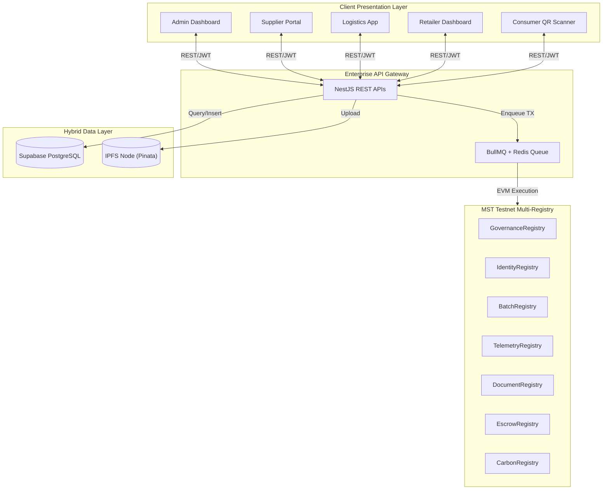

# MST SaralChain — Enterprise SRS (Software Requirements Specification)

## Product Name
MST SaralChain Global Logistics Infrastructure

## Tagline
Blockchain-Powered Supply Chain Transparency & Settlement Ecosystem

---

## 1. Project Overview
### Vision
Build a scalable enterprise-grade supply chain infrastructure on the MST Testnet that eliminates counterfeit goods, prevents data silos, enables real-time physical verification via QR codes, and automates international settlements through trustless crypto escrows.

The platform must support:
- FMCG (Fast-Moving Consumer Goods) tracking
- Pharmaceutical cold-chain monitoring
- Luxury goods authentication
- Agricultural export compliance
- Automotive parts tracking
- International Customs document management

The system should function as a multi-tenant platform where manufacturers, logistics providers, retailers, and customs agencies can interact seamlessly to manage, verify, and settle physical goods transactions via blockchain.

---

## 2. Objectives
### Primary Goals
- Eliminate counterfeit products from the supply chain
- Prevent unverified manual data entry and "paper-based" fraud
- Enable real-time blockchain verification of GPS & Temperature data
- Provide a trustless Escrow settlement layer bypassing archaic banking LCs
- Allow non-crypto retail users to scan QR codes seamlessly via mobile
- Create enterprise-ready Multi-Registry smart contract architecture
- Enable API integration with existing ERP systems (SAP, Oracle)

---

## 3. Target Users
### User Types
1. **MST Super Admin:** Controls the ecosystem, grants top-level `GOVERNANCE_ROLE`.
2. **Supplier / Manufacturer:** Creates physical batches, mints initial blockchain records.
3. **Logistics & Transporters:** Updates GPS/telemetry data, manages physical transit.
4. **Customs Officials:** Reviews and attaches IPFS compliance documents to border crossings.
5. **Retailers / Buyers:** Funds Escrow smart contracts and receives physical inventory.
6. **End Consumers:** Scans product QR codes to verify authenticity.
7. **Finance Teams:** Manages the `tMST` treasury, payments, and settlements.

---

## 4. Core System Architecture
### Platform Components

| Component | Description |
|-----------|-------------|
| **Admin Dashboard** | MST Core Governance and KYB (Know Your Business) system |
| **Supplier Portal** | Batch creation, GS1 GTIN generation, and dispatch management |
| **Logistics App** | Real-time GPS and IoT temperature telemetry ingestion |
| **Consumer QR Scanner** | Zero-cost HTML5-QRCode mobile/web verification interface |
| **Blockchain Layer** | MST Testnet Multi-Registry smart contracts (Governance, Identity, Batch, Escrow, Carbon) |
| **API Gateway** | NestJS high-frequency REST APIs for IoT and ERP integration |
| **Queuing Engine** | BullMQ + Upstash Redis to prevent EVM Nonce collisions |
| **Database Engine** | Supabase PostgreSQL for relational analytics and geospatial data |

---

## 5. MST Blockchain Integration
### MST Testnet Usage
The platform must integrate directly with:
- **MST Testnet Blockchain**
- **MST Bridge-Key Wallet** (for participant authentication and EIP-712 Meta-Transactions)
- **tMST Native Token** (for escrow payments)

---

## 6. Functional Modules

### MODULE 1 — GOVERNANCE & IDENTITY ADMIN
| Feature | Description |
|---------|-------------|
| **KYB Approval** | Organization KYC/KYB approval and wallet verification |
| **Role Assignment** | On-chain assignment of `SUPPLIER_ROLE`, `CUSTOMS_ROLE`, etc. |
| **Contract Upgrades** | Governance over Smart Contract Upgrades (UUPS) |
| **Dispute Management** | Global dispute overrides and Escrow refund authorizations |
| **API Keys** | Issuance of secure API keys for IoT devices |

### MODULE 2 — SUPPLIER DASHBOARD
| Feature | Description |
|---------|-------------|
| **Batch Creation** | Mint physical batches (Quantity, Unit, Production, Expiry) |
| **GS1 Integration** | Assign global GTIN barcodes to product batches |
| **ERP Sync** | Attach internal ERP Lot Numbers for backwards compatibility |
| **Logistics Handoff**| Cryptographically transfer possession to Transporters |
| **Escrow Tracking** | Track pending `tMST` Escrow deposits from Retailers |

### MODULE 3 — LOGISTICS, TELEMETRY & CARBON TRACKING
| Feature | Description |
|---------|-------------|
| **GPS Tracking** | High-frequency GPS ingestion from IoT sensors |
| **Condition Monitoring**| Real-time Temperature/Humidity tracking against thresholds |
| **Alert Systems** | Automated alerts for condition breaches (e.g., Temp > 8°C) |
| **Hash Anchoring** | Batch-hashing telemetry data and sequential EVM anchoring |
| **Carbon Footprint** | **Tokenized carbon calculation across the transit lifecycle** |

### MODULE 4 — CUSTOMS & COMPLIANCE PORTAL
**Document Features**
- Upload Phytosanitary Certificates and Bills of Lading
- Pin documents to IPFS (InterPlanetary File System)
- Map IPFS CIDs to specific `batchId` on the `DocumentRegistry`
- Cryptographic border clearance approvals

### MODULE 5 — RETAILER & ESCROW DASHBOARD
**Finance & Settlement Features**
- Purchase Order creation
- Deposit `tMST` funds into `EscrowRegistry`
- Scan QR code upon delivery to trigger `RetailReady` state
- Automated smart contract fund release to Supplier

### MODULE 6 — CONSUMER VERIFICATION APP
**Scanner Features**
- Zero-app-install HTML5-QRCode web scanner
- Read real-time blockchain validation
- View interactive maps of the product's journey
- View immutable IPFS compliance certificates
- Alert on fake or duplicate QR codes

---

## 7. Smart Contract Requirements
### Required Contracts (Multi-Registry)
| Contract | Purpose |
|----------|---------|
| `GovernanceRegistry` | Core Admin and global Access Control |
| `IdentityRegistry` | Maps wallets to verified corporate identities |
| `BatchRegistry` | Core asset metadata, current owner, and lifecycle stage |
| `TelemetryRegistry`| Anchors keccak256 hashes of IoT data |
| `DocumentRegistry` | Links batch IDs to IPFS CIDs for compliance |
| `EscrowRegistry` | Holds deposits and automates `tMST` settlements |
| `CarbonRegistry` | **Tokenized carbon footprint calculation across the transit lifecycle** |

---

## 8. Database Design
### Core Tables (PostgreSQL / Supabase)
**Required Tables:**
- `users`
- `organizations`
- `batches`
- `telemetry_logs`
- `customs_documents`
- `escrow_transactions`
- `api_keys`
- `fraud_logs`

---

## 9. Security Requirements
### Mandatory Security
**Authentication:**
- JWT authentication for Web2 API endpoints
- Role-based access control (RBAC) on-chain
- EIP-4361 (Sign-In with Ethereum)

**Blockchain Security:**
- Protection against Reentrancy (CEI pattern in Escrows)
- Nonce collision prevention via BullMQ
- Gas-optimized batch processing

**Infrastructure Security:**
- Rate limiting on IoT ingestion
- Supabase connection pooling (pgbouncer)

---

## 10. Performance Requirements
| Feature | Requirement |
|---------|-------------|
| **QR Scan Response** | < 1 second |
| **Telemetry Ingestion** | Support 1,000+ IoT pings/sec |
| **Blockchain Sync** | Batched hashes every 60 seconds |
| **Dashboard Load Time**| < 2 seconds |

---

## 11. Multi-Tenant SaaS Requirements
### White Label Support
Each corporate participant (Supplier/Retailer) should have:
- Isolated analytics
- Custom integration API keys
- Role-scoped data visibility

---

## 12. Non-Functional Requirements
**Scalability:**
- System must support millions of physical products without EVM bloat (hybrid architecture).
- Must handle global, concurrent logistics data streams.

**Reliability:**
- 99.9% API uptime via Vercel Edge.
- Robust BullMQ retry mechanics for failed blockchain transactions.

**Accessibility:**
- Mobile-responsive dashboards for warehouse workers.
- Cross-browser QR compatibility without native app installation.

---

## 13. Future Expansion Capabilities
### Supported Future Use Cases
- **Trade Finance & Factoring:** Using blockchain batches as collateral for instant DeFi loans.
- **Dynamic NFTs (dNFTs):** Luxury goods represented as visual NFTs that update based on maintenance records.
- **AI Supply Chain Routing:** Predictive analytics to optimize logistics paths based on historical telemetry.
- **Carbon Tracking:** Tokenized carbon footprint calculation across the entire transit lifecycle.

---

## 14. Recommended Tech Stack
**Frontend:**
- Next.js 15
- TailwindCSS
- HTML5-QRCode
- Wagmi / Viem

**Backend:**
- NestJS
- Node.js
- BullMQ
- Ethers.js

**Database & Cache:**
- PostgreSQL (Supabase)
- Prisma ORM
- Upstash (Serverless Redis)

**Blockchain:**
- Solidity 0.8.20
- Hardhat
- OpenZeppelin

---

## 15. Deliverables
### Development Deliverables
- Web admin and stakeholder portals
- Zero-cost Consumer QR Web-App
- Multi-Registry Smart Contracts suite
- High-frequency REST APIs
- Relational Database schema
- Automated Test suites (Hardhat & Jest)
- Comprehensive Technical Documentation

---

## 16. MVP Scope (Phase 1)
### Must-Have Features
- Multi-Registry Smart Contract deployment (including **Carbon Tracking**)
- NestJS Relayer and Queue configuration
- Supplier Batch Creation and GS1 mapping
- Retailer Escrow funding and auto-release
- Consumer QR Verification Scanning
- Core Supabase Integration

---

## 17. Expected End Result
A complete enterprise-ready blockchain logistics and settlement infrastructure running on the MST Testnet, capable of supporting global physical supply chains, anti-counterfeiting infrastructure, and automated B2B escrow settlements, with scalability for millions of real-world assets.
