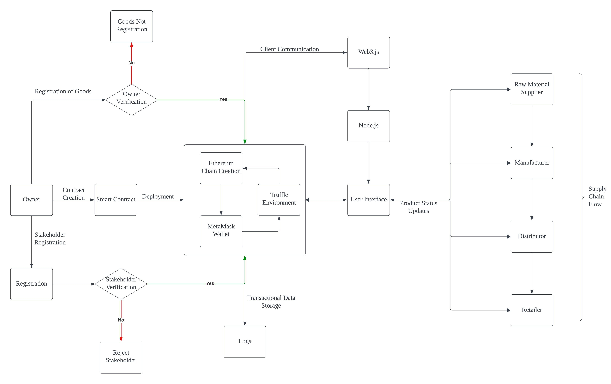
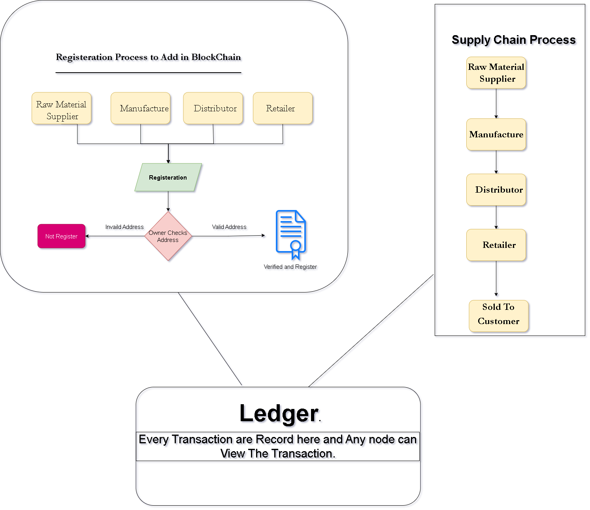
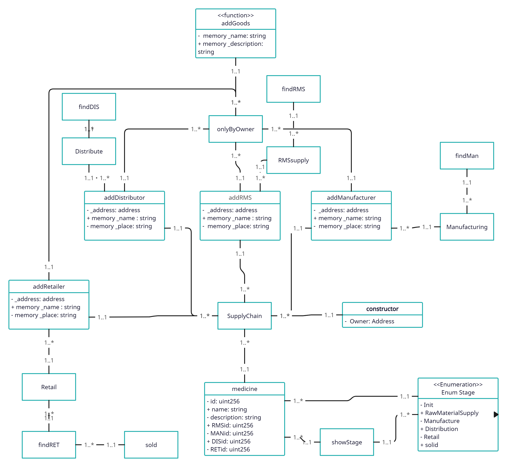
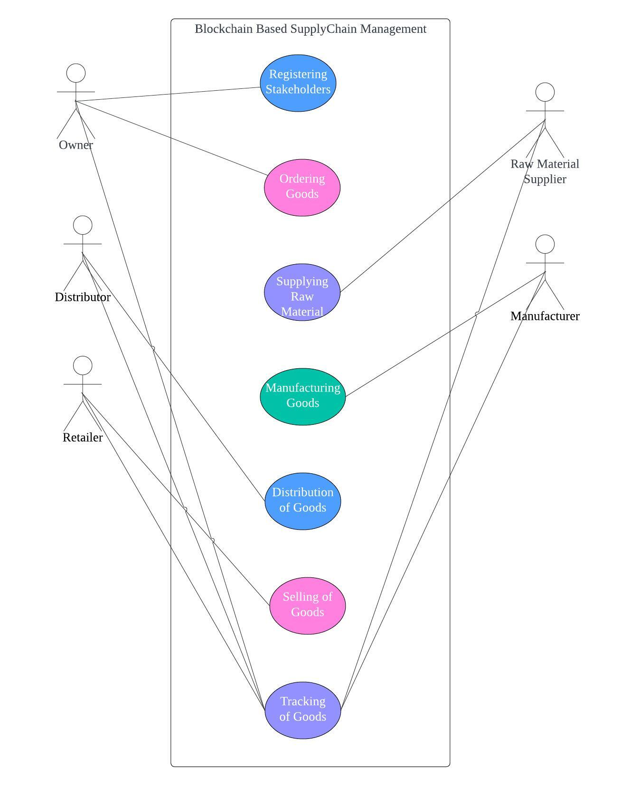
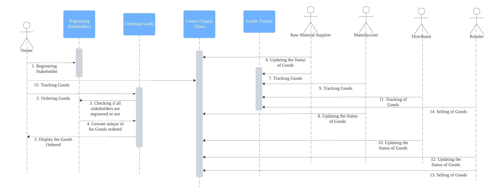
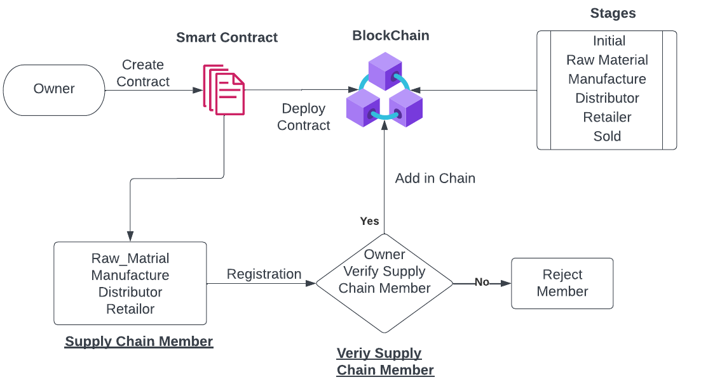

Blockchain Based Supply Chain Management

Abstract: In today’s globalized marketplace, efficient and transparent supply chain management is paramount. This project harnesses cutting-edge technology stacks to develop a robust and forward-thinking solution. At its core, it leverages the Ethereum blockchain platform, utilizing Solidity smart contracts to ensure the tamper-proof tracking of goods from their origin to their ultimate destination. This blockchain-based foundation establishes an unassailable record of all supply chain transaction, enhancing transparency, traceability, and trust. The project incorporates Ganache, a personal blockchain for Ethereum development, enabling seamless testing and deployment of smart contracts within a local, simulated environment. The frontend, designed with React JS, offers an intuitive and user-friendly interface for supply chain stakeholders. It enables real-time tracking, ensuring that users can access and validate crucial product and transaction data at any point in the supply chain process. Additionally, a comprehensive tracker has been integrated, allowing stakeholders to monitor the journey of any product along the supply chain flow, providing visibility into the parties involved at each stage. User authentication is provided by Ethereum stakeholder addresses, leveraging the inherent security and decentralized nature of the Ethereum blockchain. Web3.js enables smooth communication between the blockchain network and the backend, facilitating the seamless exchange of data and information. On the backend, powered by Node.js, seamless data processing and management is facilitated. This rich technology stack creates a dependable, decentralized, and transparent supply chain management that enhances accountability and trust throughout the entire supply network. By fostering transparency and traceability, this project empowers business to operate more efficiently and confidently in today’s complex and interconnected global market.

Table of Contents
Introduction
What is a Blockchain?
What is a Supply Chain?
Problem Statement
Objectives
Architecture Diagram
Working of Smart Contract
Class Diagram
Use Case Diagram
Sequence Diagram
Workflow of Smart Contract
Technology Stack Used
Setting up Local Development
Step 1. Installation and Setup
Step 2. Create, Compile & Deploy Smart Contract
Step 3. Run DAPP
Step 4. Connect Meta Mask with Ganache
Additional Information
Ethereum Chain
Solidity
Truffle Environment
React.js
MetaMask Wallet
Node.js
Additional Documentation
Authors
Introduction
What is a Blockchain?
Blockchain technology is a distributed, decentralized digital ledger that enables safe, transparent transaction recording and verification by numerous parties. It was initially presented as the core technology of the well-known cryptocurrency Bitcoin. Its promise goes far beyond virtual currency, though. A blockchain is fundamentally made up of a series of blocks, each of which has a list of transactions on it. Cryptographic methods are used to connect these blocks, resulting in an unchangeable and impenetrable record of every transaction. Because of its decentralized structure, transactions may be verified and validated without the need of a central authority like a bank or government.

What is a Supply Chain?
The network of all the people, companies, assets, processes, and technological advancements involved in developing and providing a good or service from suppliers to consumers is known as a supply chain. It includes every step of the process, from locating raw materials to shipping the finished good to the customer. While minimizing costs, efficient supply chain management guarantees that the appropriate product is delivered at the right time, in the right amount, and in the desired quality. Businesses must manage this intricate worldwide network of distributors, manufacturers, suppliers, and shipping companies in order to satisfy consumer needs and stay competitive.

This image illustrate the key components and flow of a typical supply chain. It depicts the interconnected network of entities involved in the process of transforming raw materials into finished products and delivering them to the end consumer.

At the center is the "Raw Materials" component, which serves as the starting point for the supply chain. Surrounding it are the various participants:

Supplier: Responsible for providing the raw materials needed for production
Manufacturer: Uses the raw materials to produce the final product.
Distributer: Facilitates the logistics and movement of goods from the manufacturer to retailers.
Retailer: The point of sale where consumers can purchase the products.
Consumer: The end-user who drives the demand for the product.
The image shows the directional flow of materials, products, and logistics, connecting each participant in the supply chain. It highlights the interdependencies and coordination required among all the entities to ensure the efficient transformation of raw materials into finished goods and their delivery to the end consumer.

Problem Statement
Supply chains in today's global business environment face challenges such as lack of transparency, traceability, fraud, delays, and fragmented traditional systems resulting in errors. Counterfeiting is a significant concern, especially in global supply chains, posing brand reputation and safety risks. Delayed payments to smaller suppliers create cash flow problems and disrupt efficiency. Opaqueness of financial transactions leads to miscommunications and conflicts, hindering cooperation and trust within the supply chain, impacting communication, cooperation, and innovation.

Objectives
To develop a robust blockchain-based supply chain ledger on the Ethereum platform using Solidity smart contracts.
To utilize React JS to build an intuitive interface that offers transparency and real-time tracking across the supply chain.
To develop smart contracts in Solidity that automate payment processes based on predefined conditions, reducing the risk of delayed payments and improving cash flow for suppliers.
To utilize Node.js for backend development to streamline and optimize the data processing and communication between the blockchain and frontend.
Create seamless integration capabilities with existing supply chain systems to ensure a smooth transition and minimal disruption for businesses already using conventional supply chain management methods.
Architecture Diagram
   

The proposed Blockchain-based Supply Chain System, consists of several steps, including Goods Node Registration, Client Communication, and Good Verification. The registration process involves verifying the authenticity of goods, such as checking against or verifying the identity of the supplier. Stakeholders, such as suppliers, manufacturers, distributors, and retailers, also register on the platform, providing unique identifiers for tracking their activities.

Client Communication utilizes Web3.js to facilitate seamless interaction with local or remote Ethereum nodes using HTTP, IPC, or WebSocket. Goods Verification integrates the system's digital signature against the Owner's public key to ensure transaction authenticity. This ensures that only the Owner has the authority to initiate orders, maintaining the integrity and security chain.

Blockchain Chain Creation uses Ethereum's blockchain technology to create immutable records, recording each transaction or update as a block on the blockchain. A User Interface for Product Status Updates is implemented using React.js, ensuring real-time updates on product status. The Supply Chain Flow represents the flow of goods through the supply chain, with each stakeholder having unique access to update their statuses.

Transactional Data Storage ensures that all transactional data is securely stored in a database, enhancing transparency among all stakeholders in the supply chain. The database can be implemented using traditional database technologies or a distributed database spread across multiple nodes in the network.

MetaMask Wallet Integration facilitates transactions within the Ethereum blockchain environment, allowing users to interact with the blockchain, including sending and receiving transactions and interacting with smart contracts. Truffle Environment simplifies the development process of Ethereum-based applications by providing built-in smart contracts with the Solidity programming language, compilation, linking, deployment, and binary management.

Working of the Smart Contract
   

This diagram illustrates a supply chain process that incorporates blockchain technology for registration and tracking of transactions. The supply chain involves several key entities: Raw Material Supplier, Manufacturer, Distributor, Retailer, and the end Customer. The left side of the diagram shows the registration process to add participants to the blockchain. Each entity (Raw Material Supplier, Manufacture, Distributor, Retailer) goes through a registration process where their address is verified. If the address invalid, they are not registered. If the address is valid, they are verified and registered on the blockchain.

The right side of the diagram depicts the traditional supply chain flow, starting from the Raw Material Supplier, then to the Manufacture, followed by the Distributor, and finally to the Retailer, who seels the product to the Customer. All transactions that occur throughout the supply chain process are recorded on a shared ledger, which is visible to any node (participant) in the blockchain network. This ledger provides transparency and traceability for every transaction that takes place within the supply chain.

Class Diagram

This class diagram represents the Blockchain Based Supply Chain Management System for goods.

Central Classes:
SupplyChain: The core class connecting various entities.
Goods: Represents the product with properties like id, name, description, and IDs for different stages.
Participants:
addManufacturer: Represents manufacturers.
addRMS: Represents Raw Material Suppliers.
addDistributor: Represents distributors.
addRetailer: Represents retailers.
Processes:
Manufacturing: Linked to manufacturers.
RMSsupply: Linked to Raw Material Suppliers.
Distribute: Linked to distributors.
Retail: Linked to retailers.
Stages: An enumeration (Enum Stage) shows the product lifecycle:
Init
Manufacture
Distribution
Retail
Sold
Functions:
addGoods: For adding new products.
findDIS, findRMS, findMan, findRET: For finding distributors, raw material suppliers, manufacturers, and retailers respectively.
onlyByOwner: Access control function.
showStage: Shows the current stage of a product.
Relationships:
The SupplyChain class is central, connecting to manufacturers, RMS, distributors, and retailers.
Each participant type(Manufacturer, RMS, distributor, retailer) has a 1 to many relationship with SupplyChain.
The goods class is connected to SupplyChain and the Stage enumeration.
Common Attributes: Many classes share attributes like _address, memory_name, and memory_place.
Use Case Diagram

This use case diagram illustrates the various processes and stakeholders involved in a blockchain-based supply chain management system. The diagram shows how different actors interact with the system through various use cases, representing the key functions in the supply chain.

Key components of the diagram:

Actors (represented by stick figures):
Owner
Raw Material Supplier
Manufacturer
Distributor
Retailer
Use Cases(represented by ovals):
Registering Stakeholders
Ordering Goods
Supply Raw Material
Manufacturing Goods
Distribution of Goods
Selling of Goods
Tracking of Goods
The diagram demonstrates how these actors interact with different processes in the supply chain:

The Owner is connected to all uses cases, which suggesting overall management and oversight of the entire process.
The Raw Material Supplier is linked to Supplying Raw Material and Tracking of Goods.
The Manufacturer is connected to Manufacturing of Goods and Tracking of Goods.
The Distributor is linked to Distribution of Goods and Tracking of Goods.
The Retailer is connected to Selling of Goods and Tracking of Goods.
Sequence Diagram

This sequence diagram illustrates the flow of interactions in a blockchain-based supply chain management system. It shows how different actors and components communicate over time to manage the supply chain process. Here's a breakdown of the sequence:

The Owner initiates the process by registering stakeholders with the Registering Stakeholders component.
The Owner then orders goods through the Ordering Goods component.
The Ordering Goods component checks if all stakeholders are registered.
It then generates a unique ID for the ordered goods.
The system displays the ordered goods to the Owner.
The Raw Material Supplier updates the status of goods in the Control Supply Chain component.
The Raw Material Supplier tracks goods using the Goods Tracker component.
The Manufacturer updates the status of goods.
The Manufacturer tracks goods.
The Distributor updates the status of goods.
The Distributor tracks goods.
The Retailer updates the status of goods.
The Retailer records the selling of goods in the Control Supply Chain component.
The Retailer completes the selling of goods.
Finally, the Owner can track goods throughout the entire process.
Workflow of Smart Contract

This workflow diagram illustrates the process of creating and managing a supply chain using blockchain and smart contracts. Here's a breakdown of the workflow:

Starting point: The process begins with the Owner.
Smart Contract Creation:
The Owner creates a smart contract.
This contract is then deployed to the Blockchain.
Supply Chain Members:
The diagram lists Raw Material Suppliers, Manufacturers, Distributors, and Retailers as potential Supply Chain Members.
These members go through a registration process.
Verification Process:
After registration, there's a verification step labeled "Owner Verify Supply Chain Memeber."
This is a decision point:
If verified (Yes), the member is added to the chain.
If not verified (No), the member is rejected.
Blockchain Integration:
Verified members are added to the blockchain.
Stages: The diagram outlines the stages of the supply chain:
Initial
Raw Material
Manufacture
Distributor
Retailer
Sold
This workflow demonstrates a controlled, secure process for managing a supply chain using blockchain technology. It ensures that only verified members can participate, and it tracks the product through various stages from raw materials to final sale.

Technology Stack Used
Blockchain Platform: Ethereum Chain
Smart Contract Development: Solidity
Frontend Development: ReactJS
Backend Development: Node.js
Wallet: MetaMask
Chain Development Platform: Truffle
Setting up Local Debelopment
Step 1. Installation and Setup
IDE: You can use any Integrated Development Environment. (I used Visual Studio Code. You can download )
Node.js: Download the latest version of Node.js from https://nodejs.org/ and after installation check version using terminal:
node -v
Git: Download the latest version of Git from the official website at https://git-scm.com/downloads and check version using terminal:
git --version
Ganache: Download the latest version of Ganache from the official website at https://www.trufflesuite.com/ganache
MetaMask: Can be installed as a browser extension from the Chrome Web Store or Firefox Add-ons store.
Step 2. Create, Compile & Deploy Smart Contract
Clone Project: Type the following command in the terminal and execute the command:
git clone https://github.com/aniru-dh21/Blockchain-Based-Supply-Chain.git
Change the working directory to the cloned project and open your choice of IDE in the working directory(I am using VSCode).
cd Blockchain-Based-Supply-Chain
code .
Install Truffle: Type the following command and execute the command:
npm install -g truffle
Install Dependencies: Type the following command and execute the command:
npm i
File Structure for DApp:
contracts: This folder contains the Solidity smart contracts for the DApp. The Migrations.sol contract is automatically created by Truffle and is used for managing migrations.
migrations: This folfer contains the JavaScript migration files used to deploy the smart contracts to the blockchain network.
test: This folder contains the JavaScript test files used to test the smart contracts.
truffle-config.js: This file contains the configuration for the Truffle project, including the blockchain network to be used and any necessary settings.
package.json: This file in generated automatically and contains the exact version of each dependency used in the project.
package-lock.json: This file is generated automatically and contains the exacy version of each dependency used in the project.
Clients: This folder contains the client-side code, typically HTML, CSS, and JavaScript, can be organized into a client folder.
Compile the smart contract: In the terminal, use the following command to compile the smart contract:
truffle compile
Deploy the smart contract:
After compile, we need to deploy your smart contract on Blockchain. In our case, we are using Ganache which is personal blockchain for Ethereum development, used to test and develop Smart Contracts.
Open Ganache and create new WorkSpace. Copy RPC Server Address.
The RPC Server is used to allow applications to communicate with the Ethereum blockchain and execute smart contract transactions, query the state of the blockchain, and interact with the Ethereum network.
Now to add RPC address in our truffle-config.js and the replace host address and port address with our ganache rcp.
After changing RPC address. Open terminal and run this command:
truffle migrate
This command will deploy smart contract to Blockchain.
Step 3. Run DAPP
Open a second terminal and change the working directory to client folder:
cd client
Install all packages in the package.json file:
npm i
Install Web3 in the package.json file:
npm install -save web3
Run the app:
npm start
The app gets hosted by default at port 3000.
Step 4. Connect Meta Mask with Ganache

Start Ganache: Start the Ganache application and make note of the RPC server URL and port number.
Connect MetaMask: Open MetaMask in your browser and click on the network dropdown in the top-right corner. Select Custom RPC and enter the RPC server URL and port number for your Ganache instance. Click Save.
Import an account: In Ganache, click on the Accounts tab and select the first account listed. Click on the Copy button next to the Private Key field.
In MetaMask, click on three dots in the top-right corner, select Import Account, and paste the private key into the private key field. Click Import.
Add All participate (Raw Materials, Supplier, Manufacture, Retail) by following above steps.
Additional Information
Ethereum Chain
The Ethereum Chain, sometimes known as Ethereum, is an open-source decentralized blockchain platform that facilitates the development of decentralized applications (DApps) for smart contracts. Vitalik Buterin came up with the idea in 2013 and it was formally introduced in 2015. Ethereum is fundamentally a distributed ledger system running on an international node network. Unlike traditional centralized systems, Ethereum relies on a vast network of computers, known as nodes, to confirm and record transactions, guaranteeing security and openness.

Ethereum is unique in that it supports Self-executing contracts with preset terms and conditions are known as smart contracts. Solidity is an Ethereum-specific programming language used to write these contracts. Smart Contracts enable automation and trust in various applications, from financial services to supply chain management. Ethereum uses a cryptocurrency called Ether (ETH) to facilitate transactions and incentivize network participants, such as miners and developers. Ether can also be used to pay for computational services within the Ethereum network.

Solidity
Solidity is a high-level, statically typed programming language designed specifically for writing smart contracts on Ethereum and other blockchain platforms. Smart contracts are contracts that execute themselves and automate and enforce blockchain transactions based on predefined criteria and conditions. Solidity serves as primary language for developing these smart contracts, and it's crucial components of the Ethereum ecosystem. Solidity's design is influenced by JavaScript and Python, making it accessible to developers familiar with these languages. It provides tools and structure for defining the logic of smart contracts, including functions, data types and control structures.

One of Solidity's core functions is its ability to handle complex financial and business logic within smart contracts. Developers can create custom tokens, manage digital assets, and establish intricate governance systems all executed autonomously on the Ethereum blockchain. Solidity promotes security through built-in features like access control, overflow protection, and automated checked to prevent common vulnerabilities such as reentrancy protection, and automated checked to prevent common vulnerabilities such as reentrancy attacks. However, it also requires a deep understanding of blockchain concepts to write secure and efficient contracts. In conclusion, Solidity is a specialized programming language empowering developers to craft smart contracts for Ethereum and other compatible blockchain platforms.

Truffle Environment
Truffle, while currently in its sunset phase, played a pivotal role in shaping the development landscape for blockchain applications, particularly on the Ethereum platform. It provided a comprehensive and user-friendly environment, streamlining the process from initial coding to deployment and testing. This made it a popular choice for developers, fostering innovation and contributing significantly to the growth of blockchain technology.

At its core, Truffle functioned as a dedicated workspace for blockchain projects. Developers could leverage its built-in features to seamlessly handle various tasks. Compiling smart contracts, the core building blocks of blockchain applications, was made effortless. Linking these contracts together and deploying them to diverse blockchain networks, both public and private, was facilitated through intuitive workflows. Additionally, Truffle integrated established testing frameworks like Mocha and Chai, allowing developers to rigorously test their smart contracts and ensure their functionality within the complex blockchain environment.

Beyond these core functionalities, Truffle offered a powerful console for real-time interaction with the blockchain. This empowered developers to test smart contract functions directly, inspect variables, and debug issues in hands-on manner. The user-friendly interface further simplified the process of deploying and managing contract updates through scripted deployments and migrations.

React.js
React, an open-source JavaScript library developed and maintained by Meta, stands as a dominant force in the realm of front-end development. Its component-based architecture empowers developers to build dynamic and interactive user interfaces (UIs) in a modular and reusable fashion. This approach fosters maintainability, scalability, and a streamlined development experience. At its core, React leverages the concept of “components,” self-contained and reusable pieces of UI that encapsulates both HTML structure and logic.

These components can be nested and combined, forming the building blocks of complex web applications. This modularity promotes code organization, reusability, and independent development, making it easier for teams to collaborate and build large-scale applications efficiently. Another key features of React is its virtual DOM (Document Object Model). This in-memory representation of the actual DOM allows React to efficiently calculate the minimal changes needed to update the UI whenever data changes. This optimization translates to faster rendering and a smoother user experience, especially in applications with frequent updates.

MetaMask Wallet
MetaMask is a widely-used cryptocurrency wallet and a browser extension that enables users to interact with decentralized applications (DApps) built on Ethereum blockchain. In the context of this project, MetaMask serves as a secure gateway for supply chain stakeholders to authenticate themselves and participate in the blockchain-based supply chain management system. By leveraging MetaMask, stakeholders can securely sign transactions and execute smart contract functions related to various supply chain operations, such as tracking product movements, verifying authenticity, and recording custody transfers. The integration with MetaMask ensures that these transactions are cryptographically signed and validated, maintaining integrity and immutability of supply chain data recorded on Ethereum blockchain. Furthermore, MetaMask enables stakeholders to manage their Ethereum-based cryptocurrency holdings, which can be used to pay transaction fees or facilitate secure value transfers within the supply chain ecosystem, if required.

Node.js
Node.js is a JavaScript runtime environment that allows developers to execute JavaScript code on the server-side. In the context of this project, Node.js is used to build the backend server, which acts as an intermediary between the frontend user interface and the Ethereum blockchain. One of the primary responsibilities of the Node.js backend is to facilitate communication between the client-side application (built with React.js) and the Ethereum blockchain network. This communication is achieved through the integration of Web3.js, a JavaScript library that provides a convenient way to interact with Ethereum nodes.

The Node.js backend utilizes Web3.js to establish a connection with the Ethereum blockchain, enabling the execution of various operations such as deploying and interacting with smart contracts, sending transactions, and retrieving data from the blockchain. This functionality is crucial for managing and tracking the supply chain data stored on the Ethereum network. Additionally, the Node.js backend handles user authentication and authorization processes. By leveraging the Ethereum stakeholder addresses as digital identities, the backend can verify and grant access to authenticated stakeholders, ensuring the security and integrity of the supply chain management system.